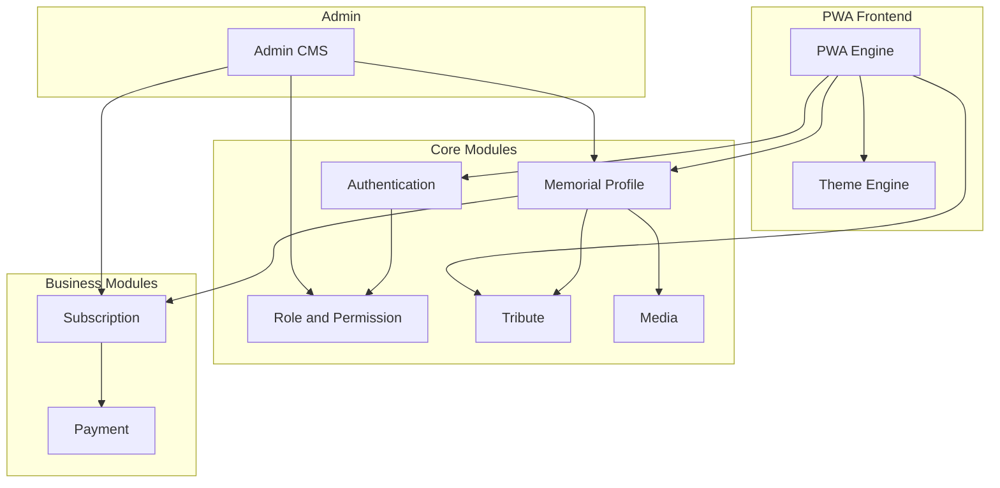
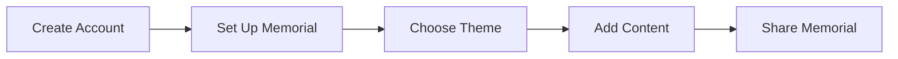
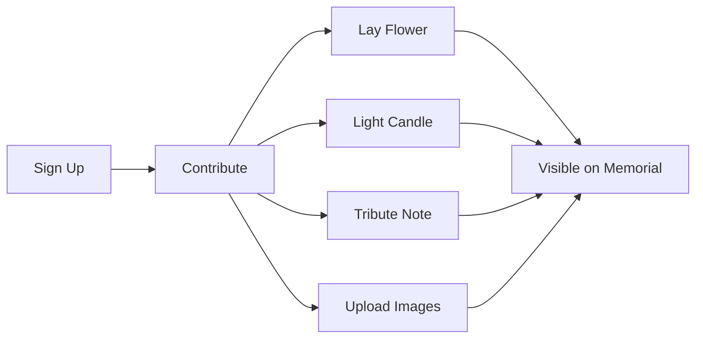

# Forever-Loved: Modular Memorial Platform Design Document

## 1. Project Overview

| Attribute | Value |
|-----------|-------|
| Product Name | Forever-Loved |
| Type | Modular memorial website platform (PWA) |
| Purpose | Allow users to create and manage memorial profiles for deceased loved ones, with tribute contributions from friends and family |

Forever-Loved is a memorial website platform where users can create and manage memorial profiles for loved ones who have passed away. The system supports contributions from friends and family, subscription-based features, and a modular architecture for long-term maintainability.

### Tech Stack

| Layer | Technology |
|-------|------------|
| Backend | Laravel 12 |
| Frontend | Blade templates, Tailwind CSS v4, Alpine.js |
| Build | Vite |
| Styling | Tailwind CSS (no React) |

---

## 2. System Architecture

The system is built as a fully modular application to support:

- Easy upgrades
- Feature expansion
- Clean separation of concerns
- Independent module enable/disable capability
- Scalable subscription handling

---

## 3. Core Features

### 3.1 Memorial Owner Flow

A user (memorial owner) can:

1. Create an account
2. Set up a memorial profile
3. Choose a theme (Free or Premium)
4. Add content:
   - Photos
   - Videos
   - Background music
   - Biography
   - Custom messages
5. Share the memorial profile via social media

### 3.2 Contributor Flow

Other users (friends and family) can:

1. Sign up
2. Contribute to a memorial by:
   - Laying a flower
   - Lighting a candle
   - Leaving a tribute note
   - Uploading images
3. All contributions appear on the memorial profile

---

## 4. User Roles and Permissions (RBAC)

The system uses role-based access control with the following roles:

| Role | Capabilities |
|------|--------------|
| Super Admin | Full system access: manage all users, subscriptions, plans; create/edit memorial profiles; assign profile ownership; modify homepage and static pages; manage themes; configure system settings (no code editing); control metadata, SEO, payment gateways, app title, system colors |
| Admin | Access controlled by Super Admin; limited access based on assigned capabilities; can manage users, subscriptions, or profiles depending on granted permissions |
| User (Memorial Owner) | Create and manage memorial profiles; choose subscription plan; manage content and media; control visibility and privacy |
| Contributor | Sign up; contribute tributes to memorial profiles; cannot edit the memorial structure |

---

## 5. Admin System Requirements

- **Content Editor:** CKEditor for content management
- **Super Admin Dashboard Controls (no code changes required):**
  - System colors (global theme variables)
  - SEO metadata
  - Payment gateways configuration
  - App title
  - Branding elements
  - Static pages (About, Terms, Privacy, etc.)

---

## 6. Payment Integration

### Gateways

- Pesapal
- Stripe

### Subscription System

- Free plans
- Premium plans
- Plan upgrades and downgrades
- Manual plan overrides by Super Admin
- Subscription editing per user

---

## 7. PWA Requirements

The application functions as a Progressive Web App with the following behavior:

- **Memorial profile pages:**
  - No full page refresh
  - Smooth application-like experience
  - Dynamic content loading (SPA-style behavior)
- **Optimization:** Mobile-first usage
- **Goal:** Immersive, seamless memorial experience

---

## 8. Modular System

| Module | Responsibility |
|--------|----------------|
| Authentication Module | User registration, login, password reset, session management |
| Role and Permission Module | RBAC implementation, capability assignment, permission checks |
| Memorial Profile Module | Memorial CRUD, profile setup, theme assignment, visibility control |
| Tribute Module | Flowers, candles, tribute notes, contributor submissions |
| Media Module | Photo and video uploads, storage, optimization, background music |
| Subscription Module | Plan management, upgrades, downgrades, plan limits |
| Payment Module | Pesapal and Stripe integration, payment processing |
| Theme Engine Module | Free and premium themes, theme switching, customization |
| Admin CMS Module | CKEditor integration, static pages, system settings |
| PWA/Frontend Engine | SPA behavior, service worker, offline support, mobile-first UI |

---

## 9. Open Decisions (Clarifying Questions)

The following items require stakeholder input before implementation. Update this section once decisions are made.

| Topic | Options / Notes |
|-------|-----------------|
| Themes | Database-driven, separate frontend templates, or JSON-configurable layouts? |
| Memorial visibility | Public/private toggle? Expiry dates? Permanent lifetime option? |
| Tribute moderation | Moderation before appearing? Owner approval for contributors? |
| Memorial URLs | Custom path (e.g. /memorial/john-doe)? Subdomain (e.g. john.memorialsite.com)? |
| Free plan limits | Ads allowed? Storage limits per plan? |
| Multi-language | Built from the start or deferred? |

---

## Document Conventions

- No emojis
- Neutral, professional tone throughout
- Tables and lists used for clarity
- Mermaid diagrams for architecture and user flow visualization
